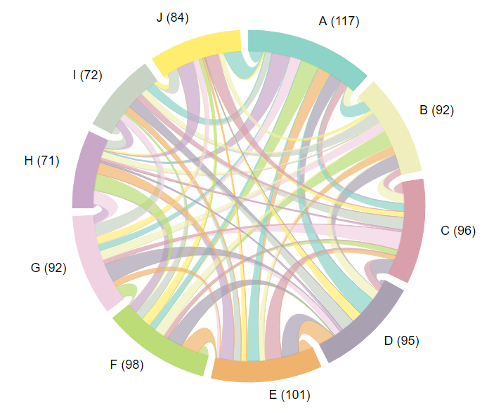
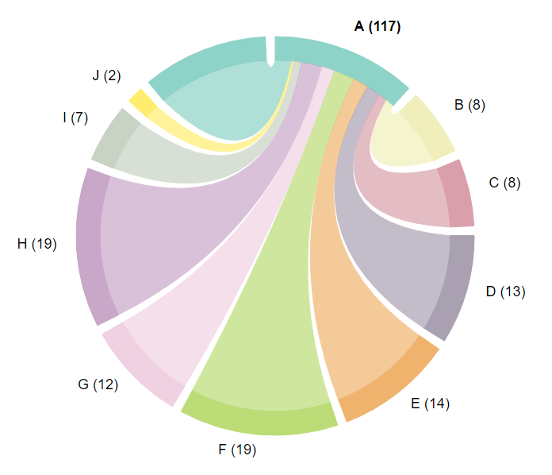

# Create an Interactive Chord Diagram in R

The `chordViz` package, based on the `chorddiag` package (http://github.com/mattflor/chorddiag) and
the viz.js D3 library (http://github.com/NPashaP/Viz), is an R htmlwidget that allows the user to create
interactive chord diagrams that emphasize the clarity of directed relationships
between groups on hover/mouseover.

## Example

```r
# Install and load package.
devtools::install_github("nredell/chordViz")
library(chordViz)

# Create an input matrix with random data.
set.seed(224)
m <- matrix(trunc(runif(100, 1, 20)), nrow = 10)

# Create the chord diagram.
chordViz(m, start = 3/2, groupNames = LETTERS[1:ncol(m)])
```

## Chord Diagram from chordViz()



## Chord Diagram Hovering Over Group 'A'


